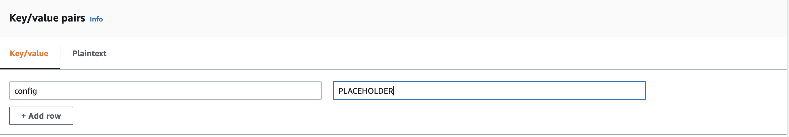
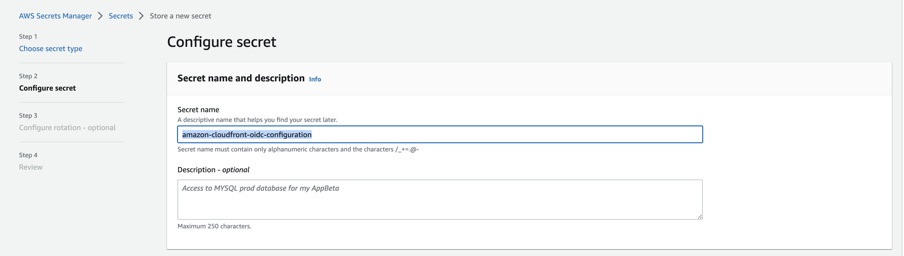
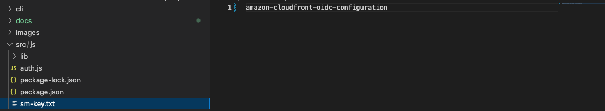

## Base Configuration

The first step for deploying this solution is to create a dummy configuration placeholder and store it into AWS Secrets Manager. For the time-being, this is just a placeholder and we will come back and update this later. 

**NOTE (Very Important!):** In the [src/js](../src/js) directory of this project, there is a file called `sm-key.txt`. This file is used by the Lambda@Edge function to determine which AWS Secrets Manager secret to pull the configurations from. It is very important that this name matches the name you give the Secret in step 7 of these instructions. For example, if you name your placeholder secret `my-cloudfront-secret`, the `sm-key.txt` file must also contain a string called `my-cloudfront-secret`.

1. Navigate to the AWS Console
2. Search for `Secrets Manager` and click on this service
3. Click on `Store a new secret`
4. For the `Secret type` select `Other type of secret`
5. In the `Key/value pairs` section, provide the following details:
    - `Key` = config
    - `Value` = PLACEHOLDER

6. Select the appropriate `Encryption key` settings for your organization's needs. The default is to use the `aws/secretsmanager` key.
7. Provide an appropriate `Secret name` - this is your choice - along with an appropriate `Description` and a set of `Tags` that make it easy to identify the Secret. For now, you can skip `Resource permissions` - you will come back to this later.

**NOTE:** This Secret Name should match the name found in the [src/js/sm-key.txt file](../src/js/sm-key.txt) as seen below and as mentioned above:

8. Click on the `Next` button.
9. Provide the `Secret rotation` settings or leave it as the default.
10. Click on `Next`.
11. Click `Store`.
12. Click on the Secret that was just created.
13. Under the `Secret details` section, copy the `Secret ARN` and save this to a notepad for later use.
14. Move on to the next step!

### Next Step

Navigate to [Deploy the AWS SAM Stack](deploy.md) for the next step.
