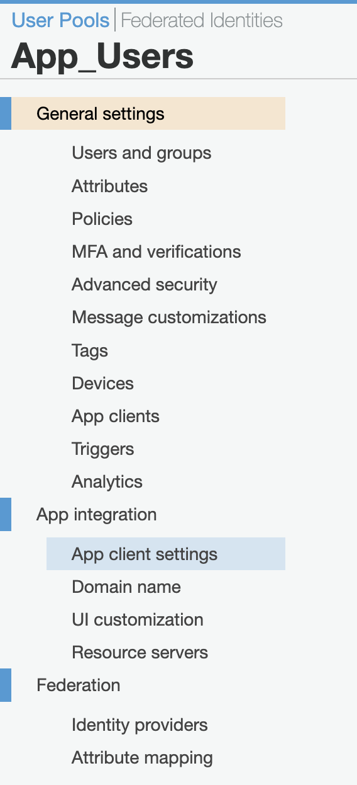
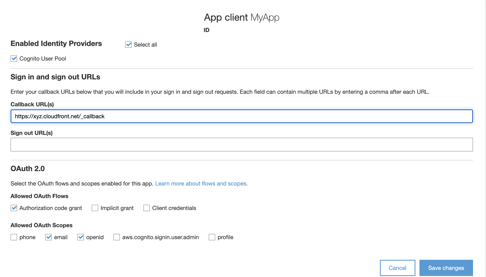
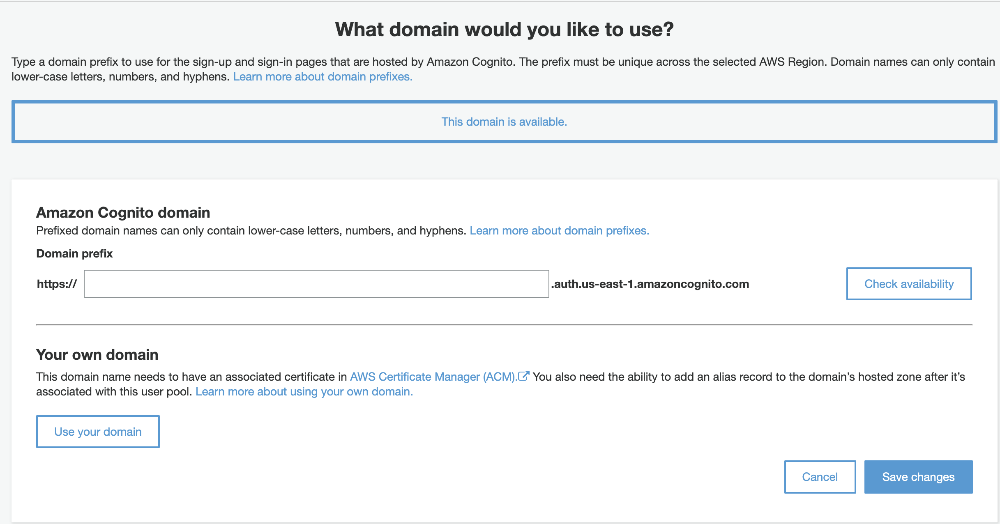

# Amazon Cognito IdP Setup

[Amazon Cognito](https://aws.amazon.com/cognito/) can be used as an IdP (Identity Provider) to secure the Amazon CloudFront Distribution created by this repository.

## Configure Amazon Cognito

In order to get started, login to the [AWS Console](https://aws.amazon.com/console/) with an identity that has the ability to manage Amazon Cognito User Pools and App integrations.

1. Search for `Cognito` in the search bar and click on the `Cognito` service.
2. Click on `Manage User Pools` next:

3. Select an existing User Pool or Create a user pool by clicking on the `Create a user pool` button in the top-left corner of the page.
4. After selecting an existing Cognito User Pool or creating a new User Pool, navigate to `App integration > App client settings` on the left of the page:

5. On the `App client settings` page select the following:
5a. `Enabled Identity Providers` = check the `Cognito User Pool`  
5b. `Sign in and sign out URLs` = for `Callback URL(s)` provide the Amazon CloudFront distribution HTTPS endpoint with `_callback` appended to the end. Provide the appropriate `Sign out URL(s)` value that is suitable.  
5c. `OAuth 2.0` = At the minimum for `Allowed OAuth Flows` check `Authorization code grant`. For `Allowed OAuth Scopes` check `email` and `openid` at the minimum.

6. After providing the necessary arguments click on `Save changes`.
7. On the next page, provide an appropriate `Amaon Cognito domain` endpoint:

8. Navigate back to the `General settings` and click on `App Clients`.
9. Create a new App client and provide it a name that is suitable for your Amazon CloudFront use-case. Select the appropriate `Auth Flows Configuration` and then click save. 
10. Expand the newly-create App Client and copy the `App client id` and the `App client secret` into a secure location that can be later referenced.
11. Update the AWS Secrets Manager JSON configuration with these values and Base64 Encode the document.
12. Congratulations! You are ready to go!

