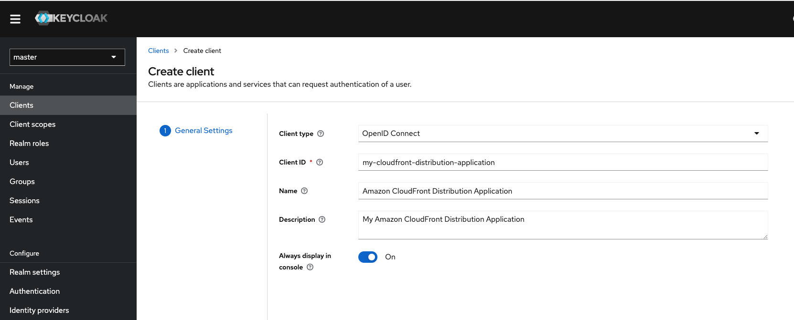
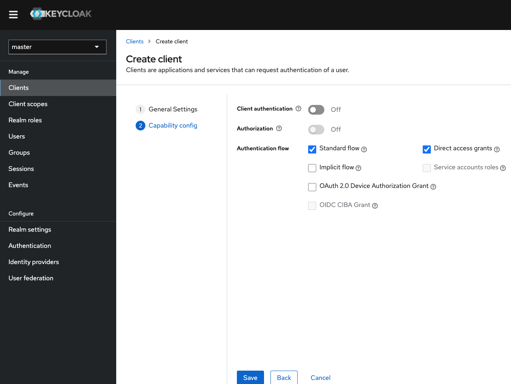
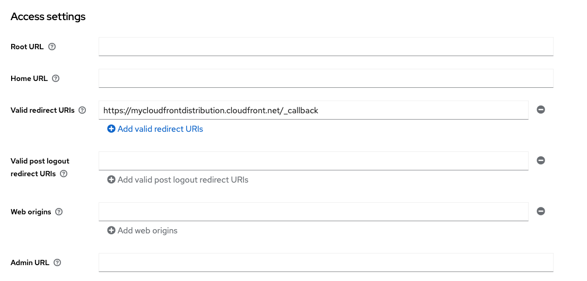
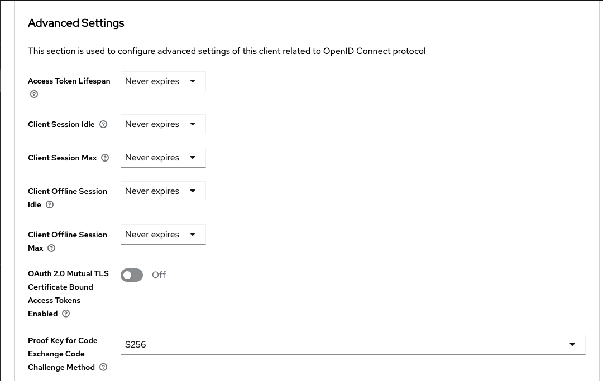

# Keycloak IdP Setup

[Keycloak](https://www.keycloak.org/) can be used as an IdP (Identity Provider) to secure the Amazon CloudFront Distribution created by this repository.

## Configure Keycloak

In order to get started, login to Keycloak with an identity that has the ability to create a new Application.

1. Navigate to `Clients` on the left of the screen and fill-in specific details about the client you would like to create like below:

2. Click on `Next`. On the next page choose the settings that work for you and your organization. At a minimum, ensure that under `Authentication flow` that `Standard flow` is checked and click `Save` like below:

3. On the next page under `Client details` navigate to the `Access settings` and at a very minimum configure the `Valid redirect URIs` with your Amazon CloudFront Distribution URL with the `/_callback` value appended to it and click on `Save` at the bottom of the screen:

4. Navigate back to the `Clients` section on the left of the screen and click on the Client you just registered. Scroll down to `Advanced Settings` and under the `Proof Key for Code Exchange Code Challenge Method` choose `S256` and click `Save`:

5. Update the AWS Secrets Manager Configuration with the appropriate IDP URL and the Client ID. The Client ID will be the value that you gave to the application during the Client Creation process. In this cae it will be `my-cloudfront-distribution-application`. There is no Client Secret used so this value can be ignored since you will use [PKCE](https://oauth.net/2/pkce/) or Proof Key for Code Exchange to securely interact with the IDP and the Amazon CloudFront Distribution.

6. That is all!