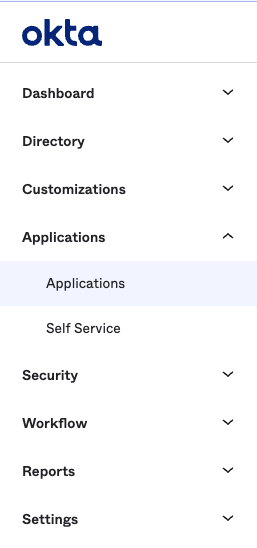
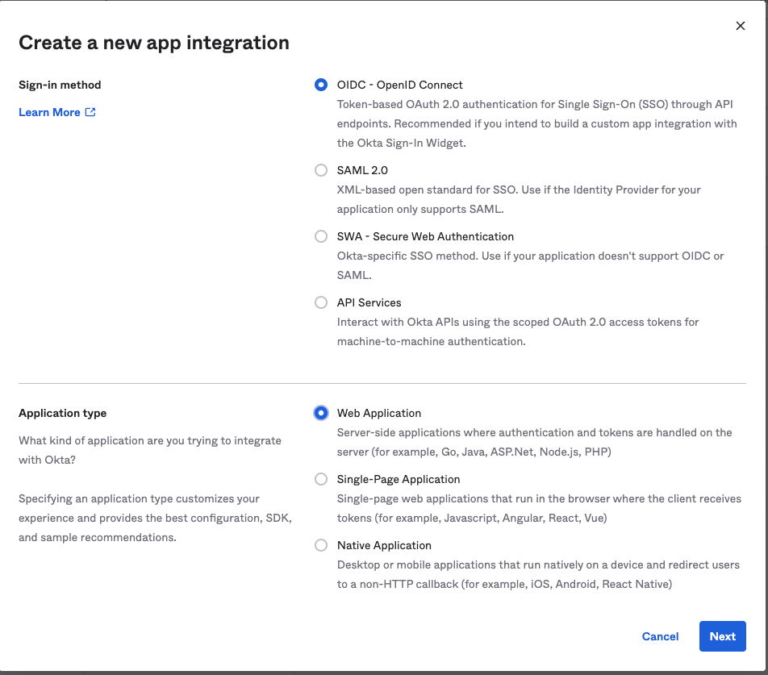
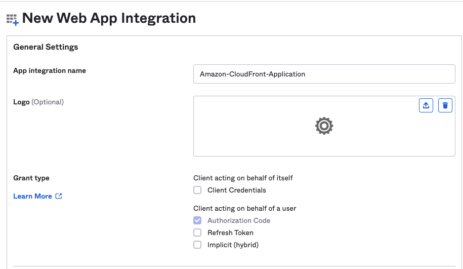
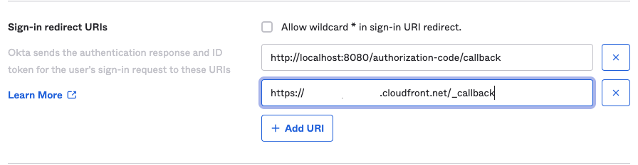
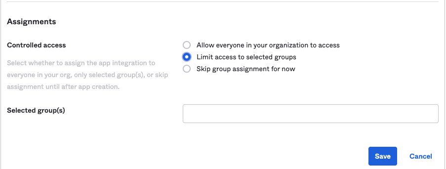
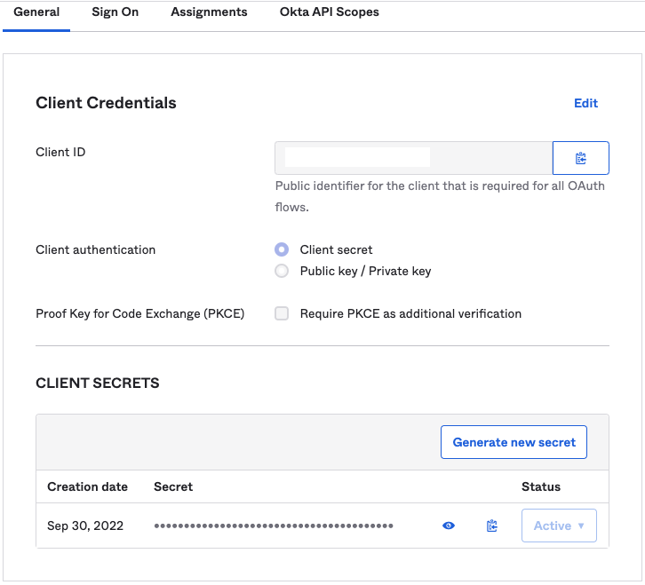

# Okta IdP Setup

[Okta](https://www.okta.com/) can be used as an IdP (Identity Provider) to secure the Amazon CloudFront Distribution created by this repository.

## Configure Okta

In order to get started, login to Okta with an identity that has the ability to create a new Application.

1. Navigate to **Applications** > **Applications**  

2. Click on **Create App Integration** and select the following options:  

The following options should be selected: 
- `Sign-in method:` **OIDC - OpenID Connect**
- `Application type:` **Web Application**

3. On the next page under **General Settings** ensure the following are selected:  

The following options should be selected: 
- `Client acting on behalf of a user:` **Authorization Code**

Feel free to name the application anything that suits your use-case and is easy for you and your organization to understand.

4. Navigate to your AWS Account and obtain the generated HTTPS Amazon CloudFront endpoint generated. This will be in the form of **https://xyz.cloudfront.net**. Copy this full link and save it to in a text editor for the next step.

5. Navigate back to the Okta Application Registration page. Under the **Sign-in redirect URIs** section, paste in the Amazon CloudFront distribution link obtained from Step 4 and add it as a new Sign-In Redirect URI and appen `/_callback` to the end of the link. As an example, please see the following format: `https://xyz.cloudfront.net/_callback`.

6. Under the **Assignments** section on the Okta web page, select the set of groups in your organization to scope this Application usage to. Or allow all users (depending on your use-case).

7. Click on `Save` after you have selected all relevant options and configurations for your use-case.

8. Navigate back to the **Applications** section in Okta and click on the newly-created Application registered from above. Securely copy the **Client ID** and the **Client Secret** values

9. Update the AWS Secrets Manager Secret with the Application Client ID and the Client Secret and Base64 encode the JSON document.

10. Congratulations! You have configured your Amazon CloudFront Distribution with Okta!
