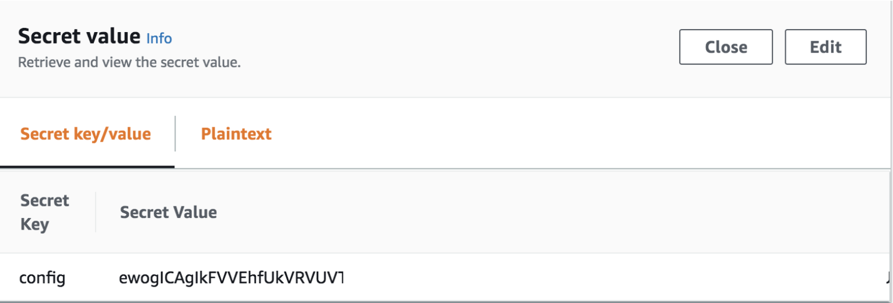

## AWS Secrets Manager Setup

AWS Secrets Manager is used to store OIDC configuration information that is accessible to the created Amazon CloudFront Distribution.
The secret is created outside of the SAM template in order to not enforce specific encryption at rest standards.

Revisit the secret created from Step 1 of the instructions and paste in the Base64-encoded value.

Here is an example of what the final configuration should look like in AWS Secrets Manager for the configuration:

**NOTE:** The Secret Value presented here is the **Base64-Encoded** JSON configuration.

### Next Step

Navigate to [Navigate to Amazon CloudFront URL / Troubleshoot](cloudfront.md) for the next step.

